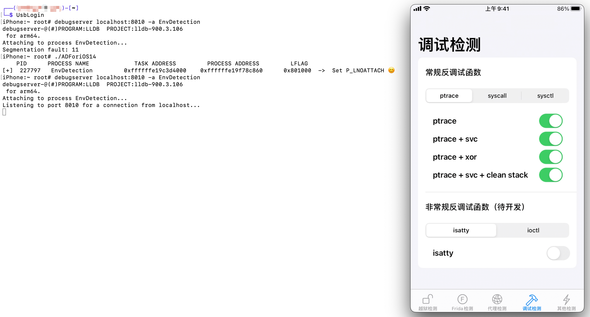

# AllowDebugging
A tool of kernel level for bypassing debug detection!

## Support Devices

iOS 13.0 - iOS 14.8（During Testing, Perhaps higher）

A7 - A10（During Testing, Perhaps higher）

## Usage

1. Open an application
2. Run ADForiOS13 / ADForiOS14（Based on your system version）
3. Run debugserver to attach

## Dispaly

